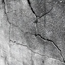
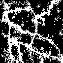

# Building Crack Detection with SegFormer

## Overview
This project focuses on detecting cracks in building structures using semantic segmentation. By leveraging NVIDIA's SegFormer model, we achieve efficient and accurate crack detection on images. The project includes data preprocessing, model fine-tuning, and evaluation on custom datasets.

## Features
- Utilizes **SegFormer** for state-of-the-art semantic segmentation.
- Trained on crack segmentation datasets with custom class weights to handle class imbalance.
- Includes a pipeline for training, validation, and inference.
- Outputs segmentation masks for crack detection.

## Getting Started

### Prerequisites
Ensure you have the following installed:
- Python 3.8+
- PyTorch 1.11+
- Transformers (Hugging Face library)
- CUDA (if GPU support is needed)

Install dependencies using:
```bash
pip install -r requirements.txt
```

### Dataset Preparation
Organize your dataset as follows:
```
Dataset/
├── train/
│   ├── chunk_1/
│   │   ├── images/
│   │   └── masks/
│   └── ...
├── val/
│   ├── chunk_1/
│   │   ├── images/
│   │   └── masks/
│   └── ...
```
- **Images**: RGB images of the building surfaces.
- **Masks**: Binary masks with `0` for the background and `1` for cracks.

### Training
1. Configure paths and parameters in the script:
   - `resized_data_root`: Path to your dataset.
   - `num_epochs`, `batch_size`, `learning_rate`: Training hyperparameters.
2. Run the training script in the BldgCrack.ipynb:

The script performs chunk-based training to handle large datasets efficiently. Checkpoints are saved in the `checkpoints_segformer5` directory.

### Validation
During training, validation is performed after each epoch using a subset of the dataset. Validation loss and other metrics are logged.

### Inference
Use the following script to generate segmentation masks on test images:
```python
from PIL import Image
import torch
from transformers import SegformerFeatureExtractor, SegformerForSemanticSegmentation

# Load model
model_path = './checkpoints_segformer5/segformer_finetuned_epoch_32.pth'
model = SegformerForSemanticSegmentation.from_pretrained(
    "nvidia/segformer-b0-finetuned-ade-512-512", num_labels=2
)
model.load_state_dict(torch.load(model_path)['model_state_dict'])
model.eval()

# Load image
image_path = "path/to/test/image.jpg"
image = Image.open(image_path).convert("RGB")
feature_extractor = SegformerFeatureExtractor.from_pretrained(
    "nvidia/segformer-b0-finetuned-ade-512-512"
)
pixel_values = feature_extractor(images=image, return_tensors="pt").pixel_values

# Predict
with torch.no_grad():
    outputs = model(pixel_values=pixel_values)
predictions = torch.argmax(outputs.logits, dim=1).squeeze(0).cpu().numpy()

# Save or visualize prediction
output_path = "predicted_mask.png"
Image.fromarray(predictions * 255).convert("L").save(output_path)
```

## Results
- **Training Loss**: Tracked across 32 epochs.
- **Validation Loss**: Evaluated after each epoch.
- Example segmentation mask output:




## Future Work
- Fine-tune the model on larger and more diverse datasets.
- Integrate real-time inference capabilities.
- Experiment with other architectures like UNet or DeepLabV3.

## Acknowledgments
- Model: [NVIDIA SegFormer](https://huggingface.co/nvidia/segformer-b0-finetuned-ade-512-512)
- Frameworks: PyTorch, Hugging Face Transformers


